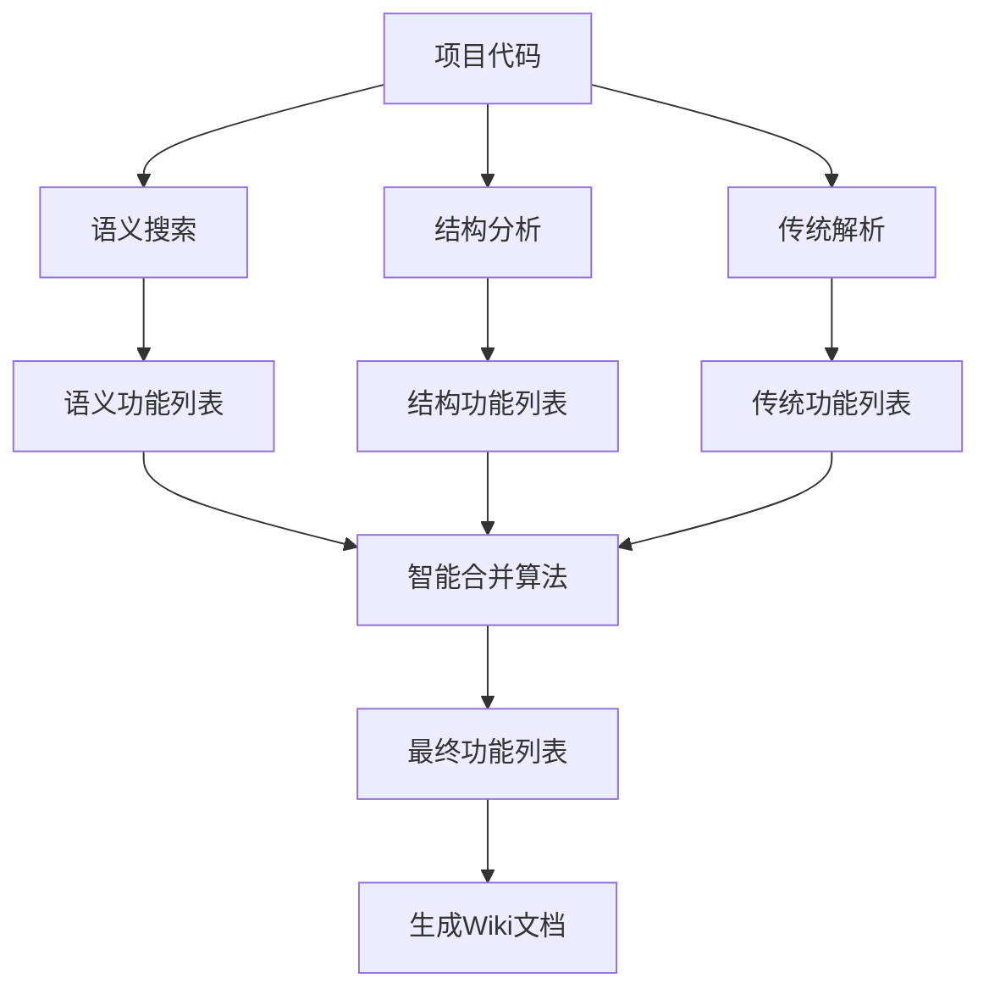

# 🔀 混合模式Wiki生成器使用指南

## 🌟 混合模式概述

混合模式Wiki生成器是GraphRAG插件的**最强大功能**，它结合了三种不同的分析策略：

1. **🤖 语义搜索** - AI智能功能发现
2. **🏗️ 结构分析** - 代码架构深度分析  
3. **📋 传统解析** - 完整覆盖所有代码

通过智能权重配置和结果融合，为您提供最全面、最准确的项目Wiki文档。

## 🚀 快速开始

### 方法1：使用预设模式

执行命令：
```
Ctrl+Shift+P → "GraphRAG: 混合模式Wiki生成器"
```

选择预设的混合模式：
- **🎯 平衡模式** - 语义40% + 结构40% + 传统20%
- **🤖 AI优先模式** - 语义60% + 结构30% + 传统10%
- **🏗️ 架构分析模式** - 结构60% + 语义30% + 传统10%
- **📋 完整覆盖模式** - 传统50% + 结构30% + 语义20%

### 方法2：自定义配置

执行命令：
```
Ctrl+Shift+P → "GraphRAG: 自定义混合模式配置"
```

自定义各种策略的权重比例和功能选项。

## 🔍 三种分析策略详解

### 🤖 语义搜索策略

**原理**：使用AI向量嵌入技术进行语义化代码理解

**优势**：
- ✅ 智能功能发现，能找到隐含的业务逻辑
- ✅ 跨语言语义理解
- ✅ 自然语言查询支持

**适用场景**：
- 复杂业务项目分析
- 功能模块发现
- 业务逻辑梳理

**示例发现**：
```
查询"用户登录" → 自动发现：
- authenticateUser() 函数
- LoginValidator 类
- sessionManager 模块
- tokenService 相关代码
```

### 🏗️ 结构分析策略  

**原理**：基于代码的静态结构关系进行分析

**优势**：
- ✅ 深度架构分析
- ✅ 调用关系追踪
- ✅ 继承关系解析
- ✅ 模块依赖分析

**适用场景**：
- 架构文档生成
- 重构影响分析
- 依赖关系梳理

**分析维度**：
```
🔗 模块分析 - 按文件模块分组
📞 调用关系 - 函数调用链分析
🧬 继承关系 - 类继承结构分析
🎯 组件分析 - Vue组件特化分析
```

### 📋 传统解析策略

**原理**：基于AST解析的传统代码分析

**优势**：
- ✅ 100%代码覆盖
- ✅ 精确的语法分析
- ✅ 完整的API文档
- ✅ 可靠的类型信息

**适用场景**：
- API文档生成
- 完整代码索引
- 类型定义文档

**解析内容**：
```
📋 所有函数定义
🏗️ 所有类和接口
📦 所有模块导入导出
🔧 所有变量和常量
```

## 🎯 混合模式工作原理

### 1. 多策略并行分析



### 2. 智能合并算法

混合模式使用优先级合并策略：

1. **优先处理语义功能**（置信度最高）
2. **合并重叠的结构功能**
3. **补充传统解析的遗漏**
4. **去重和质量验证**

### 3. 覆盖率和置信度计算

- **覆盖率** = 已分析节点数 / 总节点数
- **置信度** = 加权平均各策略的准确性评分

## 📊 生成的文档结构

### 主要文档

- **README.md** - 混合分析概览和统计
- **ARCHITECTURE.md** - 项目架构分析
- **FEATURES.md** - 功能模块详细列表
- **API_REFERENCE.md** - 完整API文档
- **BUSINESS_LOGIC.md** - 业务逻辑分析
- **ANALYSIS_REPORT.md** - 详细分析报告

### 功能详细文档

每个发现的功能都包含：

#### 📈 增强的功能信息
```markdown
## 用户登录模块

### 📊 功能统计
- 来源: 🤖 语义发现
- 置信度: 85%
- 代码实体: 15 个
- 涉及文件: 3 个

### 🔀 合并信息
- 语义搜索: 发现核心业务逻辑
- 结构分析: 补充调用关系
- 传统解析: 完善类型定义
```

#### 🏗️ 多维架构分析
- 入口节点（API接口）
- 核心逻辑（业务实现）
- 辅助函数（工具方法）
- 配置相关（设置选项）

#### 🔄 完整执行流程
```
1. handleLogin() [入口]
   ↓
2. validateCredentials() [验证]
   ↓
3. authenticateUser() [认证]
   ↓
4. generateToken() [令牌]
```

## ⚙️ 配置选项详解

### 权重配置

**语义搜索权重** (0-1)
- 控制AI语义分析的影响力
- 推荐值：0.3-0.6

**结构分析权重** (0-1)  
- 控制代码结构分析的影响力
- 推荐值：0.3-0.5

**传统解析权重** (0-1)
- 控制传统解析的影响力
- 推荐值：0.1-0.3

> ⚠️ **注意**：三个权重之和必须等于1.0

### 功能开关

```json
{
  "enableSemanticDiscovery": true,     // 启用语义发现
  "enableStructuralAnalysis": true,    // 启用结构分析
  "enableTraditionalParsing": true,    // 启用传统解析
  
  "generateArchitectureDocs": true,    // 生成架构文档
  "generateFeatureDocs": true,         // 生成功能文档
  "generateApiDocs": true,             // 生成API文档
  "generateBusinessDocs": true,        // 生成业务文档
  
  "minFeatureNodes": 3,                // 功能最小节点数
  "maxFeatureDepth": 5,                // 功能分析最大深度
  "enableContentValidation": true      // 启用内容验证
}
```

## 🎯 使用场景和建议

### 场景1：新项目理解
**推荐配置**：🎯 平衡模式
- 语义40% + 结构40% + 传统20%
- 全面了解项目结构和业务逻辑

### 场景2：架构文档生成
**推荐配置**：🏗️ 架构分析模式
- 结构60% + 语义30% + 传统10%
- 重点分析模块关系和依赖结构

### 场景3：API文档编写
**推荐配置**：📋 完整覆盖模式
- 传统50% + 结构30% + 语义20%
- 确保所有接口和类型完整覆盖

### 场景4：业务逻辑梳理
**推荐配置**：🤖 AI优先模式
- 语义60% + 结构30% + 传统10%
- 智能发现复杂的业务流程

## 💡 最佳实践

### 1. 预处理建议

**代码优化**：
- ✅ 添加有意义的函数和类名
- ✅ 完善代码注释
- ✅ 保持模块化结构

**环境准备**：
- ✅ 配置嵌入服务（OpenAI/Ollama等）
- ✅ 构建完整知识图谱
- ✅ 确保网络连接稳定

### 2. 配置调优

**项目规模调整**：
```
小项目(<1000节点): 语义50% + 结构40% + 传统10%
中项目(<5000节点): 语义40% + 结构40% + 传统20%
大项目(>5000节点): 语义30% + 结构50% + 传统20%
```

**分析深度调整**：
```
快速预览: maxFeatureDepth = 3, minFeatureNodes = 5
标准分析: maxFeatureDepth = 5, minFeatureNodes = 3
深度分析: maxFeatureDepth = 7, minFeatureNodes = 2
```

### 3. 结果优化

**质量验证**：
- ✅ 启用内容验证
- ✅ 检查覆盖率指标
- ✅ 审查置信度评分

**迭代改进**：
- 🔄 根据结果调整权重
- 🔄 补充遗漏的功能关键词
- 🔄 优化代码注释和命名

## ⚠️ 注意事项

### 性能考虑
- 🚨 大项目分析时间较长（可能需要几分钟）
- 🚨 语义搜索需要网络连接
- 🚨 建议在性能较好的机器上运行

### API限制
- 🚨 注意嵌入服务的API配额
- 🚨 OpenAI等服务可能产生费用
- 🚨 考虑使用本地Ollama服务

### 结果理解
- 🚨 置信度<60%的功能需要人工验证
- 🚨 覆盖率<80%可能存在遗漏
- 🚨 复杂项目建议多次迭代分析

## 🐛 故障排除

### 问题1：分析时间过长
**解决方案**：
- 减少maxFeatureDepth
- 增加minFeatureNodes
- 关闭不必要的文档生成选项

### 问题2：功能发现不准确
**解决方案**：
- 增加语义搜索权重
- 检查嵌入服务配置
- 添加更多功能关键词

### 问题3：覆盖率偏低
**解决方案**：
- 增加传统解析权重
- 检查文件忽略规则
- 确保所有代码文件被扫描

### 问题4：置信度偏低
**解决方案**：
- 优化代码注释和命名
- 增加结构分析权重
- 启用内容验证功能

---

通过混合模式，您可以获得**最全面、最准确、最智能**的项目Wiki文档！🎉

**核心优势总结**：
- 🔀 **多策略融合** - 结合三种分析方法的优势
- 🎯 **智能权重** - 根据项目特点调整策略比重
- 📊 **质量保证** - 覆盖率和置信度双重验证
- 🚀 **适用性强** - 适合各种规模和类型的项目