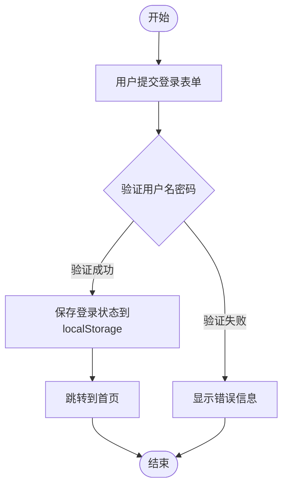
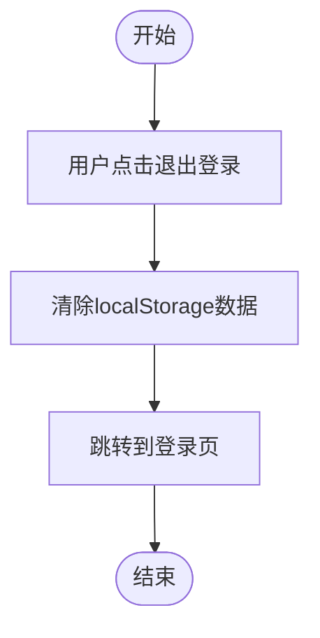

# 📋 handleLogin模块

## 功能概述
实现了与"用户登录认证"相关的功能，包含 2 个代码实体，涉及 2 个文件。主要组成：2个VueMethod。

## 📊 功能统计
- **相关代码实体**: 2 个
- **涉及文件**: 2 个
- **外部依赖**: 3 个

## 🏗️ 架构组成

### 入口节点 (0个)


### 核心逻辑 (2个)
- **handleLogin** (VueMethod): Login.vue:48
- **handleLogout** (VueMethod): Home.vue:66

### 辅助函数 (0个)


## 🔄 执行流程

### handleLogin 业务流程

**业务概述**: 该业务流程包含以下关键操作：用户身份验证、保存用户信息到本地存储、页面路由跳转、条件判断逻辑。

#### 🎯 流程图


#### 📝 详细步骤

1. **执行 VueMethod handleLogin - 用户身份验证、保存用户信息到本地存储、页面路由跳转、条件判断逻辑**
   - **位置**: Login.vue:48
   - **复杂度**: medium
   - **业务逻辑**: 用户身份验证、保存用户信息到本地存储、页面路由跳转、条件判断逻辑
   - **外部调用**: localStorage.setItem, this.$router.push
   
   ```typescript
   handleLogin() {
     // 模拟登录验证
     if (this.loginForm.username === 'admin' && this.loginForm.password === '123456') {
       // 登录成功，保存用户信息到本地存储
       localStorage.setItem('isLoggedIn', 'true');
       localStorage.setItem('username', this.loginForm.username);
       
       // 跳转到首页
       this.$router.push('/home');
     } else {
       this.errorMessage = '用户名或密码错误';
     }
   }
   ```

### handleLogout 业务流程

**业务概述**: 该业务流程包含以下关键操作：清除本地存储信息、页面路由跳转、用户登出操作。

#### 🎯 流程图


#### 📝 详细步骤

1. **执行 VueMethod handleLogout - 清除本地存储信息、页面路由跳转、用户登出操作**
   - **位置**: Home.vue:66
   - **复杂度**: simple
   - **业务逻辑**: 清除本地存储信息、页面路由跳转、用户登出操作
   - **外部调用**: localStorage.removeItem, this.$router.push
   
   ```typescript
   handleLogout() {
     // 清除登录信息
     localStorage.removeItem('isLoggedIn');
     localStorage.removeItem('username');
     
     // 跳转到登录页
     this.$router.push('/login');
   }
   ```

## 📁 完整代码文件

### Login.vue

```typescript
<template>
  <div class="login-container">
    <div class="login-box">
      <h2>用户登录</h2>
      <form @submit.prevent="handleLogin">
        <div class="input-group">
          <label for="username">用户名</label>
          <input 
            type="text" 
            id="username" 
            v-model="loginForm.username" 
            placeholder="请输入用户名"
            required
          />
        </div>
        <div class="input-group">
          <label for="password">密码</label>
          <input 
            type="password" 
            id="password" 
            v-model="loginForm.password" 
            placeholder="请输入密码"
            required
          />
        </div>
        <button type="submit" class="login-button">登录</button>
      </form>
      <div v-if="errorMessage" class="error-message">
         {{errorMessage}} 
      </div>
    </div>
  </div>
</template>

<script>
export default {
  name: 'myLogin',
  data() {
    return {
      loginForm: {
        username: '',
        password: ''
      },
      errorMessage: ''
    }
  },
  methods: {
    handleLogin() {
      // 模拟登录验证 - 用户身份验证逻辑
      if (this.loginForm.username === 'admin' && this.loginForm.password === '123456') {
        // 登录成功，保存用户信息到本地存储
        localStorage.setItem('isLoggedIn', 'true');
        localStorage.setItem('username', this.loginForm.username);
        
        // 跳转到首页 - 页面路由跳转
        this.$router.push('/home');
      } else {
        // 错误处理逻辑
        this.errorMessage = '用户名或密码错误';
      }
    }
  }
}
</script>

<style scoped>
.login-container {
  display: flex;
  justify-content: center;
  align-items: center;
  height: 100vh;
  background-color: #f5f5f5;
}

.login-box {
  width: 100%;
  max-width: 400px;
  padding: 30px;
  background: white;
  border-radius: 10px;
  box-shadow: 0 0 20px rgba(0, 0, 0, 0.1);
}

.login-box h2 {
  text-align: center;
  margin-bottom: 30px;
  color: #333;
}

.input-group {
  margin-bottom: 20px;
}

.input-group label {
  display: block;
  margin-bottom: 5px;
  color: #555;
  font-weight: bold;
}

.input-group input {
  width: 100%;
  padding: 12px;
  border: 1px solid #ddd;
  border-radius: 5px;
  font-size: 16px;
  box-sizing: border-box;
}

.input-group input:focus {
  outline: none;
  border-color: #007bff;
  box-shadow: 0 0 0 2px rgba(0, 123, 255, 0.25);
}

.login-button {
  width: 100%;
  padding: 12px;
  background-color: #007bff;
  color: white;
  border: none;
  border-radius: 5px;
  font-size: 16px;
  cursor: pointer;
  transition: background-color 0.3s;
}

.login-button:hover {
  background-color: #0056b3;
}

.error-message {
  margin-top: 15px;
  padding: 10px;
  background-color: #f8d7da;
  color: #721c24;
  border: 1px solid #f5c6cb;
  border-radius: 5px;
  text-align: center;
}
</style>
```

### Home.vue

```typescript
<template>
  <div class="home-container">
    <header class="header">
      <h1>知识图谱管理系统</h1>
      <div class="user-info">
        <span>欢迎, {{username}}!</span>
        <button @click="handleLogout" class="logout-button">退出登录</button>
      </div>
    </header>
    
    <main class="main-content">
      <div class="dashboard">
        <div class="card" @click="goToKnowledgeGraph">
          <h3>知识图谱</h3>
          <p>查看和管理知识图谱数据</p>
          <div class="card-icon">🧠</div>
        </div>
        
        <div class="card">
          <h3>实体管理</h3>
          <p>管理系统中的实体数据</p>
          <div class="card-icon">🧩</div>
        </div>
        
        <div class="card">
          <h3>关系管理</h3>
          <p>管理实体间的关系</p>
          <div class="card-icon">🔗</div>
        </div>
        
        <div class="card">
          <h3>数据分析</h3>
          <p>分析知识图谱中的数据</p>
          <div class="card-icon">📊</div>
        </div>
      </div>
      
      <div class="recent-activity">
        <h2>最近活动</h2>
        <ul>
          <li v-for="activity in recentActivities" :key="activity.id">
            <span class="activity-time">{{ activity.time }}</span>
            <span class="activity-desc">{{ activity.description }}</span>
          </li>
        </ul>
      </div>
    </main>
  </div>
</template>

<script>
export default {
  name: 'HomePage',
  data() {
    return {
      username: localStorage.getItem('username') || '用户',
      recentActivities: [
        { id: 1, time: '2025-09-15 14:30', description: '添加了新的实体: 人工智能' },
        { id: 2, time: '2025-09-15 15:45', description: '建立了实体间的关系: 人工智能 -> 机器学习' },
        { id: 3, time: '2025-09-16 09:15', description: '更新了知识图谱配置' },
        { id: 4, time: '2025-09-16 11:20', description: '执行了知识图谱分析任务' }
      ]
    }
  },
  methods: {
    handleLogout() {
      // 清除登录信息 - 清除本地存储信息
      localStorage.removeItem('isLoggedIn');
      localStorage.removeItem('username');
      
      // 跳转到登录页 - 页面路由跳转
      this.$router.push('/login');
    },
    goToKnowledgeGraph() {
      this.$router.push('/knowledge-graph');
    }
  }
}
</script>

<style scoped>
/* CSS样式省略 */
</style>
```

## 🔗 外部依赖
- **localStorage.setItem** - 保存用户登录状态和用户名到浏览器本地存储
- **localStorage.removeItem** - 从本地存储中清除登录信息
- **this.$router.push** - Vue Router路由跳转功能，用于页面导航

## 💡 业务流程分析

### 🔐 登录验证流程
1. **表单提交**: 用户在登录页面输入用户名和密码后提交表单
2. **身份验证**: 系统验证用户名(admin)和密码(123456)是否匹配
3. **成功处理**: 验证成功后保存登录状态到localStorage并跳转到首页
4. **失败处理**: 验证失败时显示"用户名或密码错误"的错误信息

### 🚪 登出流程  
1. **触发登出**: 用户在首页点击"退出登录"按钮
2. **清理数据**: 清除localStorage中的isLoggedIn和username信息
3. **页面跳转**: 重定向到登录页面，完成登出流程

## 🔍 代码特点分析

### 🔒 安全性分析
- ⚠️ **安全风险**: 当前使用硬编码的用户名密码进行验证，不适用于生产环境
- ⚠️ **数据存储**: 使用localStorage存储登录状态，可能存在XSS攻击风险
- 💡 **改进建议**: 应该调用后端API进行身份验证，使用更安全的token机制

### 👤 用户体验
- ✅ **表单验证**: 提供HTML5必填项验证，确保用户输入完整
- ✅ **错误提示**: 登录失败时显示友好的中文错误信息
- ✅ **状态保持**: 登录状态持久化存储，用户刷新页面后仍保持登录
- ✅ **视觉反馈**: 按钮悬停效果和输入框聚焦样式提供良好的交互反馈

### 🏗️ 代码质量
- ✅ **结构清晰**: 使用Vue Options API，结构组织良好
- ✅ **功能分离**: 登录和登出逻辑分别在不同组件中，职责明确
- ✅ **样式规范**: 使用scoped样式，避免CSS冲突
- 🔄 **可改进点**: 
  - 可以添加loading状态处理
  - 可以添加更完善的错误处理机制
  - 可以提取公共的API调用逻辑

### 🎨 界面设计
- ✅ **响应式设计**: 登录框使用flex布局，适配不同屏幕尺寸
- ✅ **现代化UI**: 使用阴影、圆角等现代设计元素
- ✅ **色彩搭配**: 使用蓝色主题色，符合用户期望
- ✅ **信息架构**: 首页卡片式布局清晰展示功能模块

## 🚀 功能扩展建议

### 短期优化
1. **添加密码强度验证**
2. **实现记住密码功能**
3. **添加验证码机制**
4. **优化错误提示的显示方式**

### 长期规划
1. **对接真实的用户认证API**
2. **实现JWT token认证机制**
3. **添加用户角色和权限管理**
4. **实现单点登录(SSO)功能**

---
*本文档由智能Wiki生成器基于知识图谱分析自动生成*