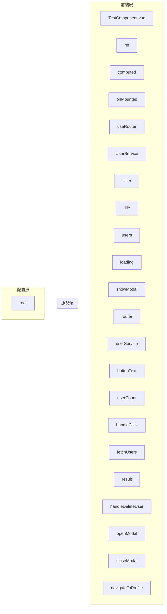
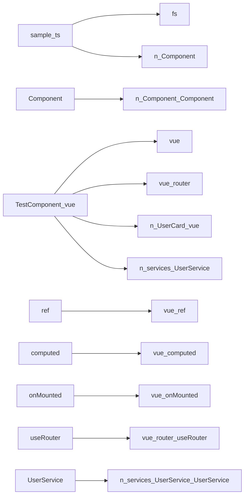

# 🏗️ 架构文档

## 项目架构图

## 依赖关系图

## 架构层级说明

### 前端组件层
- **TestComponent.vue**: Module (TestComponent.vue)
- **ref**: Variable (TestComponent.vue)
- **computed**: Variable (TestComponent.vue)
- **onMounted**: Variable (TestComponent.vue)
- **useRouter**: Variable (TestComponent.vue)
- **UserService**: Variable (TestComponent.vue)
- **User**: Interface (TestComponent.vue)
- **title**: Variable (TestComponent.vue)
- **users**: Variable (TestComponent.vue)
- **loading**: Variable (TestComponent.vue)
- **showModal**: Variable (TestComponent.vue)
- **router**: Variable (TestComponent.vue)
- **userService**: Variable (TestComponent.vue)
- **buttonText**: Variable (TestComponent.vue)
- **userCount**: Variable (TestComponent.vue)
- **handleClick**: Variable (TestComponent.vue)
- **fetchUsers**: Variable (TestComponent.vue)
- **result**: Variable (TestComponent.vue)
- **handleDeleteUser**: Variable (TestComponent.vue)
- **openModal**: Variable (TestComponent.vue)
- **closeModal**: Variable (TestComponent.vue)
- **navigateToProfile**: Variable (TestComponent.vue)

### 服务逻辑层
- 暂无服务组件

### 配置管理层
- **root**: Json (config.json)
